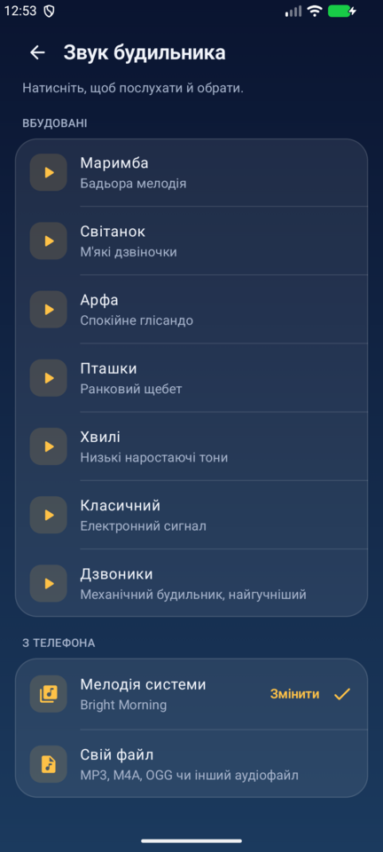
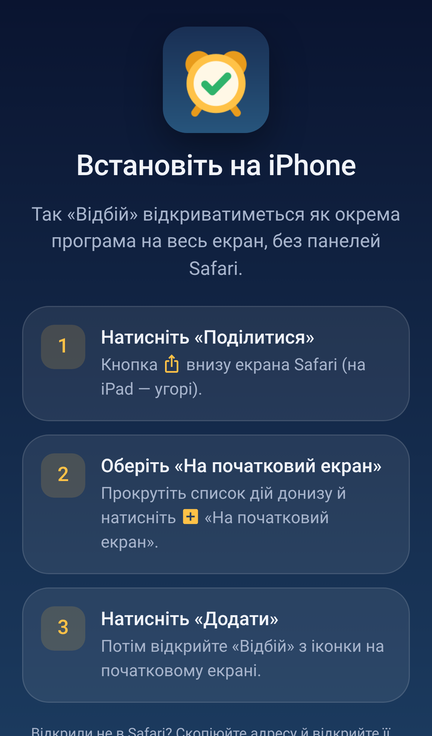
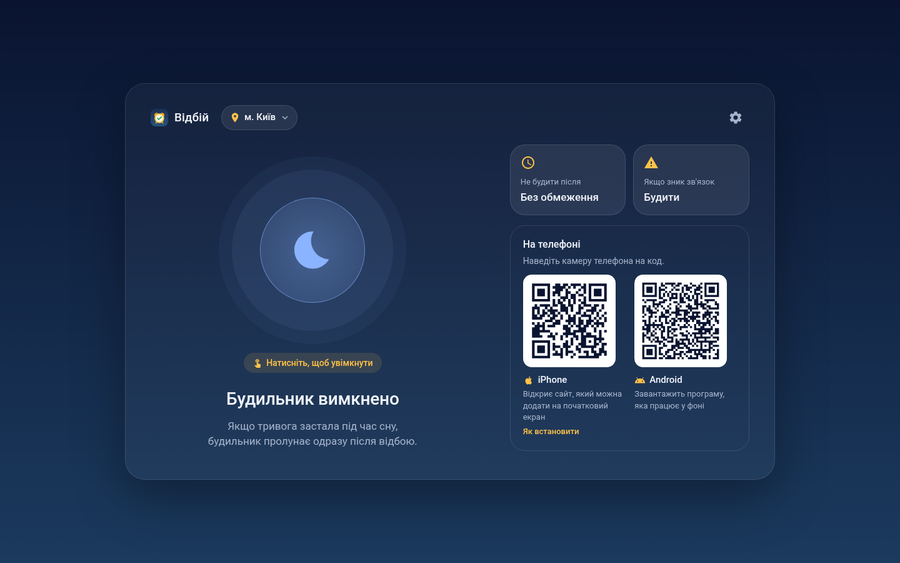

# Відбій

Будильник, що спрацьовує після відбою повітряної тривоги. Тривога застала під час сну? Торкніться місяця й спіть далі: щойно у вашій області, районі чи громаді настане відбій, пролунає гучний будильник. Зручно, наприклад, щоб не проспати онлайн-пару після тривоги.

<p align="center">
  
  
  
</p>

<p align="center">
  <b><a href="https://github.com/OlexiyOdarchuk/vidbiy/releases/latest/download/Vidbiy.apk">⬇ Android: завантажити APK</a></b>
  &nbsp;·&nbsp;
  <b><a href="https://vidbiy.ishawyha.dev/">🌙 iPhone і комп'ютер: vidbiy.ishawyha.dev</a></b>
</p>

## Яку версію обрати

| Пристрій | Версія | Як працює |
|---|---|---|
| **Android** | [програма (APK)](https://github.com/OlexiyOdarchuk/vidbiy/releases/latest/download/Vidbiy.apk) | У фоні, навіть коли телефон заблоковано. Найнадійніший варіант. |
| **iPhone** | [сайт](https://vidbiy.ishawyha.dev/), доданий на початковий екран | У «режимі тумбочки»: програма відкрита, телефон на зарядці. |
| **Комп'ютер** | [сайт](https://vidbiy.ishawyha.dev/) | Поки вкладка відкрита й комп'ютер не спить. |

Сайт сам визначає пристрій: на Android одразу пропонує завантажити APK, на iPhone показує, як додати його на початковий екран, а на комп'ютері показує QR-коди для обох телефонів.

## Як це працює

1. **Оберіть місце**: область, район або громаду, де ви навчаєтесь чи працюєте.
2. **Торкніться місяця**, коли тривога застала під час сну. Програма перевіряє стан тривоги кожні 20 секунд.
3. **Прокиньтеся після відбою.** На весь екран увімкнеться будильник, навіть у беззвучному режимі.
4. Після **«Вимкнути»** програма зупиняється й до наступного разу у фоні не працює.

Якщо ввімкнути будильник, коли тривоги немає, він дочекається наступної тривоги й спрацює після її відбою.

## Можливості

- **Область, район або громада.** Пошук за назвою або перехід «область → район → громада». Тривогою вважається тривога в самому місці, у тому, що його охоплює (район, область), або в будь-якій його частині.
- **Звук на вибір.** На Android за замовчуванням грає системна мелодія будильника (та сама, що в «Годиннику»). Є сім вбудованих мелодій (маримба, світанок, арфа, пташки, хвилі, класичний, дзвоники) з прослуховуванням. Можна поставити свій аудіофайл, а на Android ще й будь-яку мелодію телефона. Якщо обраний звук не відкривається, грає запасний, тож будильник не промовчить.
- **«Не будити після».** Якщо відбій настане пізніше заданого часу, наприклад коли пари вже закінчились, будильник вимкнеться без сигналу.
- **«Будити, якщо зник зв'язок».** Сигнал, якщо жодне джерело даних не відповідає понад 5 хвилин, щоб не проспати через збій мережі.
- **«Ще 5 хвилин»**, вібрація, на Android — поступове наростання гучності.
- **Знайомство з програмою** під час першого запуску: дозволи, вибір місця, звук і короткий тур.

<p align="center">
  
  
  
  
  
</p>

## Android

1. Завантажте [`Vidbiy.apk`](https://github.com/OlexiyOdarchuk/vidbiy/releases/latest/download/Vidbiy.apk) і відкрийте його на телефоні. Android попросить дозволити встановлення з невідомих джерел.
2. Під час першого запуску дайте дозволи: сповіщення, показ на весь екран, робота без обмежень батареї. На Samsung і Xiaomi останній особливо важливий, інакше система може приспати програму.

Нові версії встановлюються поверх старих, налаштування зберігаються. Потрібен Android 8.0 або новіший.

## iPhone і комп'ютер

<p align="center">
  
  
</p>

iPhone не дозволяє сайтам працювати у фоні, тому веб-версія працює в «режимі тумбочки»:

1. Відкрийте **vidbiy.ishawyha.dev** у Safari → «Поділитися» → «На початковий екран». Сайт відкриватиметься як окрема програма.
2. Коли почалась тривога, торкніться місяця, поставте телефон на зарядку й залиште програму відкритою.
3. Екран не гасне, а через 30 секунд сторінка затемнюється майже до чорного. Після відбою грає гучний сигнал. Він звучить навіть у беззвучному режимі, але гучність береться з кнопок гучності.

Якщо згорнути програму чи заблокувати телефон, iOS зупинить сторінку й будильник не спрацює. Після повернення програма попередить, скільки часу вона не стежила за тривогою.

На комп'ютері вкладку можна не тримати на виду: у фоні браузер перевіряє тривогу рідше, приблизно раз на хвилину. Головне — не закривати вкладку й не присипляти комп'ютер.

## Джерела даних

| Джерело | Ключ | Рівень | Примітка |
|---|---|---|---|
| [siren.pp.ua](https://siren.pp.ua/) | не потрібен | область, район, громада | обгортка над api.ukrainealarm.com, основне джерело |
| [ubilling.net.ua](https://wiki.ubilling.net.ua/doku.php?id=aerialalertsapi) | не потрібен | область | запасне джерело |
| [alerts.in.ua](https://devs.alerts.in.ua/) | власний | область | лише в Android, необов'язкове, ключ вводиться в налаштуваннях |

Якщо основне джерело недоступне, програма по черзі звертається до інших. Для району чи громади працює лише siren.pp.ua, бо інші джерела знають тільки області.

> Жодне з цих API не гарантує 100% надійності. Для важливих подій варто мати запасний звичайний будильник.

## Структура репозиторію

| Шлях | Що там |
|---|---|
| [`app/`](app/) | Android-програма: Kotlin, Jetpack Compose, Material 3. Мережа — HttpURLConnection і org.json, без сторонніх бібліотек. |
| [`web/`](web/) | Сайт (PWA): HTML, CSS і JavaScript без збирання. Публікується на GitHub Pages. |
| [`worker/`](worker/) | Проксі на Cloudflare Worker. siren.pp.ua та ubilling не дозволяють браузерам читати свої дані з інших сайтів (немає CORS), тому сайт ходить через нього. Відповіді кешуються на 15 секунд. |
| [`tools/`](tools/) | Генератори: звуки (`make_sounds.py`), QR-коди (`make_qr.py`), прев'ю для соцмереж (`make_og.py`). |
| [`docs/screenshots/`](docs/screenshots/) | Скріншоти для цього README. |

## Збирання й публікація

**Android.** Потрібні JDK 17+ і Android SDK (compileSdk 36).

```sh
./gradlew assembleRelease
# app/build/outputs/apk/release/app-release.apk
```

Кожен пуш у `main` збирає APK у GitHub Actions ([`build.yml`](.github/workflows/build.yml)). До релізу варто додавати файл і з версією (`Vidbiy-1.2.apk`), і без неї (`Vidbiy.apk`): на другий веде постійне посилання `…/releases/latest/download/Vidbiy.apk` і QR-код на сайті.

**Сайт.** Для локальної перевірки:

```sh
python3 -m http.server 8000 --directory web   # http://localhost:8000 (проксі дозволяє цей порт)
```

Зміни в `web/` публікуються автоматично ([`pages.yml`](.github/workflows/pages.yml)). Під час публікації до адрес файлів додається версія коміту, щоб кеш Cloudflare не віддав новий `index.html` зі старим `app.js`.

**Проксі.**

```sh
cd worker && wrangler deploy
```

Дозволені адреси сайту задані в `ALLOWED_ORIGINS` у [`worker/src/index.js`](worker/src/index.js).

**Звуки, QR-коди й прев'ю.**

```sh
python3 tools/make_sounds.py   # web/sounds/ та app/src/main/res/raw/ (потрібні numpy і ffmpeg)
uv run tools/make_qr.py        # web/qr/
python3 tools/make_og.py       # web/og.png (потрібен Playwright)
```
