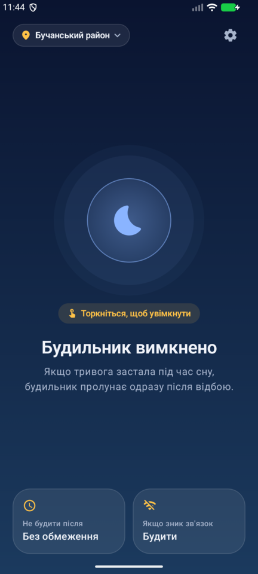
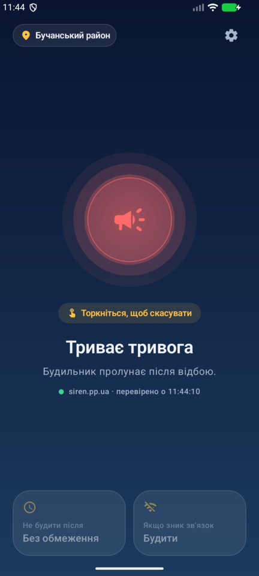
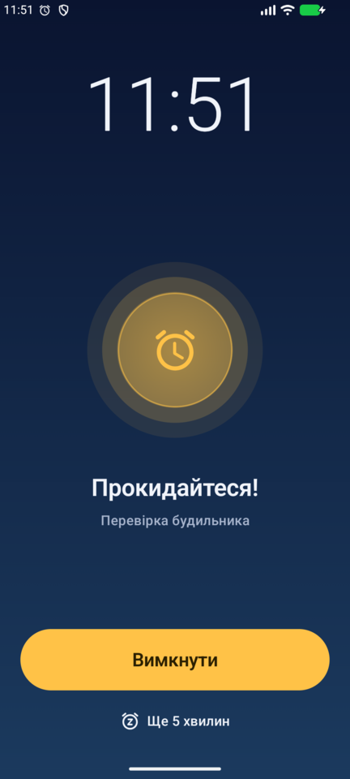
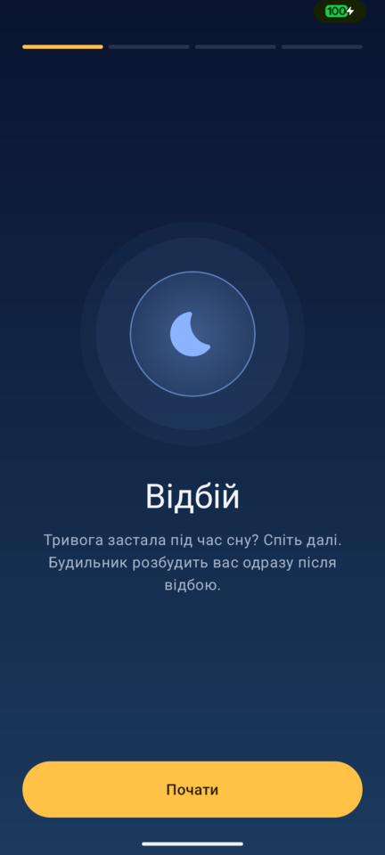
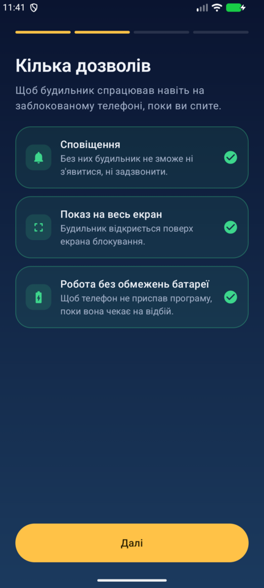
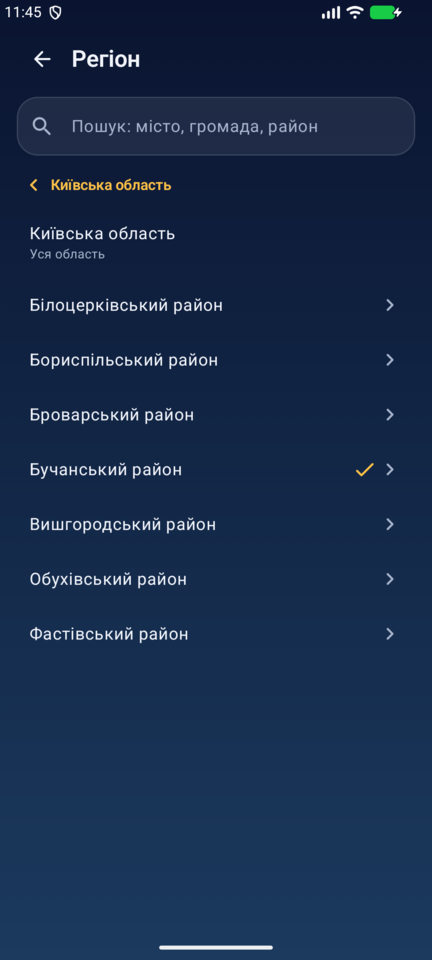
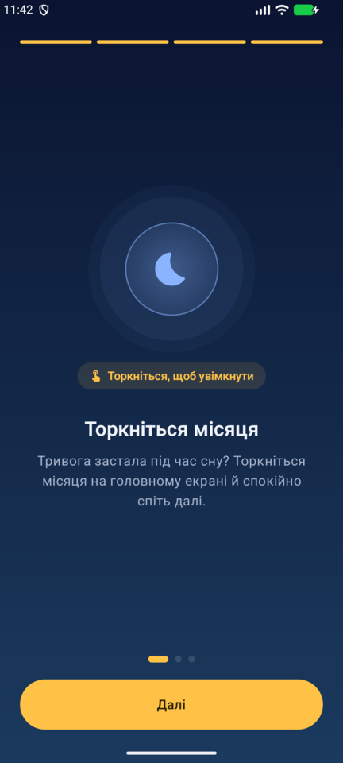
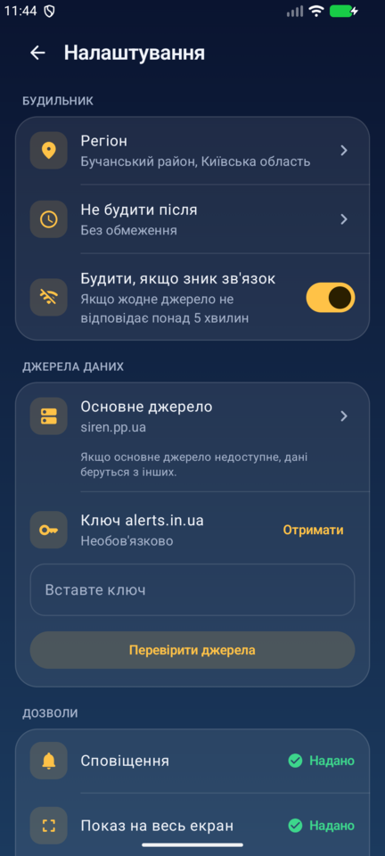

# Відбій

Android-будильник, що спрацьовує після відбою повітряної тривоги. Тривога застала під час сну? Торкніться місяця й спіть далі: щойно в обраному місці настане відбій, пролунає гучний будильник. Зручно, наприклад, щоб не проспати онлайн-пару після тривоги.

<p align="center">
  
  
  
</p>

**[⬇ Завантажити APK для Android](../../releases/latest)** · **[🌙 Веб-версія для iPhone](https://vidbiy.ishawyha.dev/)**

## Як це працює

1. **Торкніться місяця** на головному екрані. Програма почне перевіряти стан тривоги у вашому місці кожні 20 секунд.
2. Коли тривога закінчиться, на весь екран увімкнеться гучний будильник, навіть у беззвучному режимі й на заблокованому телефоні.
3. Після **«Вимкнути»** програма зупиняється й у фоні не працює до наступного разу.

Якщо ввімкнути будильник, коли тривоги немає, він дочекається наступної тривоги й спрацює після її відбою.

## Можливості

- **Область, район або громада.** Пошук за назвою або перехід «область → район → громада». Тривогою вважається тривога в самому місці, у тому, що його охоплює (район, область), або в будь-якій його частині.
- **«Не будити після».** Якщо відбій настане пізніше заданого часу, наприклад коли пари вже закінчились, будильник вимкнеться без сигналу.
- **«Будити, якщо зник зв'язок».** Сигнал, якщо жодне джерело даних не відповідає понад 5 хвилин, щоб не проспати через збій мережі.
- **«Ще 5 хвилин»**, поступове наростання гучності, вібрація.
- **Знайомство з програмою** під час першого запуску: дозволи, вибір місця й короткий тур.

<p align="center">
  
  
  
  
  
</p>

## Веб-версія для iPhone

**https://vidbiy.ishawyha.dev/**

iPhone не дозволяє сайтам працювати у фоні, тому веб-версія працює в «режимі тумбочки»:

1. Відкрийте сайт у Safari → «Поділитися» → «На початковий екран». Він відкриватиметься як окрема програма.
2. Коли почалась тривога, торкніться місяця, поставте телефон на зарядку й залиште програму відкритою.
3. Екран не гасне, а через 30 секунд сторінка затемнюється майже до чорного. Після відбою грає гучний сигнал. Він звучить навіть у беззвучному режимі, але гучність береться з кнопок гучності.

Якщо згорнути програму чи заблокувати телефон, iOS зупинить сторінку й будильник не спрацює. Після повернення програма попередить, скільки часу вона не стежила за тривогою.

Сайт лежить у [`web/`](web/) і публікується на GitHub Pages. siren.pp.ua та ubilling не дозволяють браузерам читати свої дані з інших сайтів (немає CORS), тому запити йдуть через маленький проксі на Cloudflare Worker ([`worker/`](worker/)), який ще й кешує відповіді на 15 секунд.

## Джерела даних

| Джерело | Ключ | Рівень | Примітка |
|---|---|---|---|
| [siren.pp.ua](https://siren.pp.ua/) | не потрібен | область, район, громада | обгортка над api.ukrainealarm.com, основне джерело |
| [ubilling.net.ua](https://wiki.ubilling.net.ua/doku.php?id=aerialalertsapi) | не потрібен | область | запасне джерело |
| [alerts.in.ua](https://devs.alerts.in.ua/) | власний | область | необов'язкове, ключ вводиться в налаштуваннях |

Якщо основне джерело недоступне, програма по черзі звертається до інших. Для району чи громади працює лише siren.pp.ua, бо інші джерела знають тільки області.

> Жодне з цих API не гарантує 100% надійності. Для важливих подій варто мати запасний звичайний будильник.

## Встановлення

1. Завантажте APK з [Releases](../../releases/latest) і відкрийте його на телефоні. Android попросить дозволити встановлення з невідомих джерел.
2. Під час першого запуску дайте дозволи: сповіщення, показ на весь екран, робота без обмежень батареї. На Samsung і Xiaomi останній особливо важливий, інакше система може приспати програму.

Потрібен Android 8.0 або новіший.

## Збирання

Потрібні JDK 17+ і Android SDK (compileSdk 36).

```sh
./gradlew assembleRelease
# app/build/outputs/apk/release/app-release.apk
```

Стек: Kotlin, Jetpack Compose, Material 3. Сторонніх бібліотек для мережі немає: HttpURLConnection і org.json.
