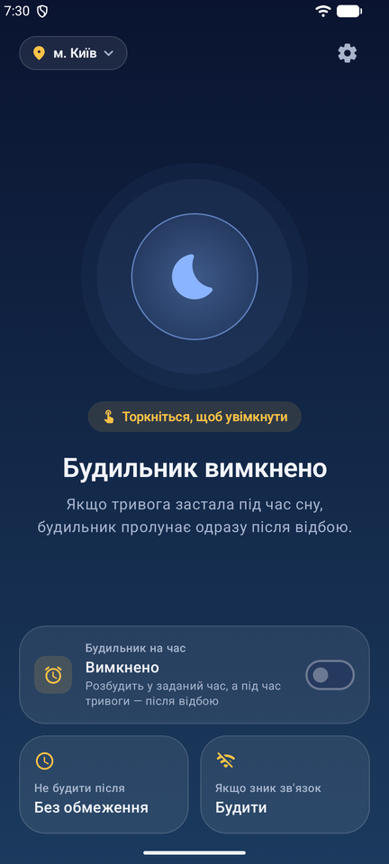
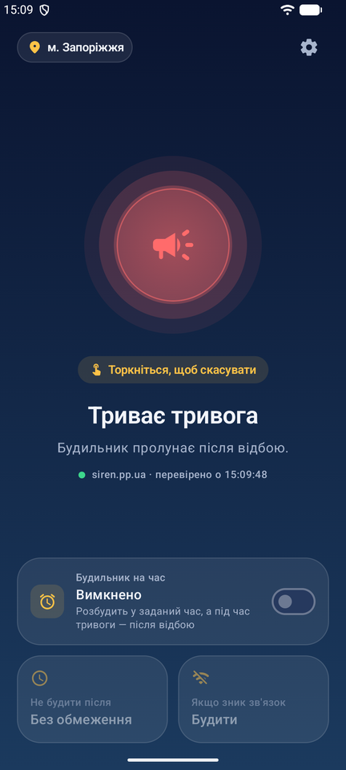
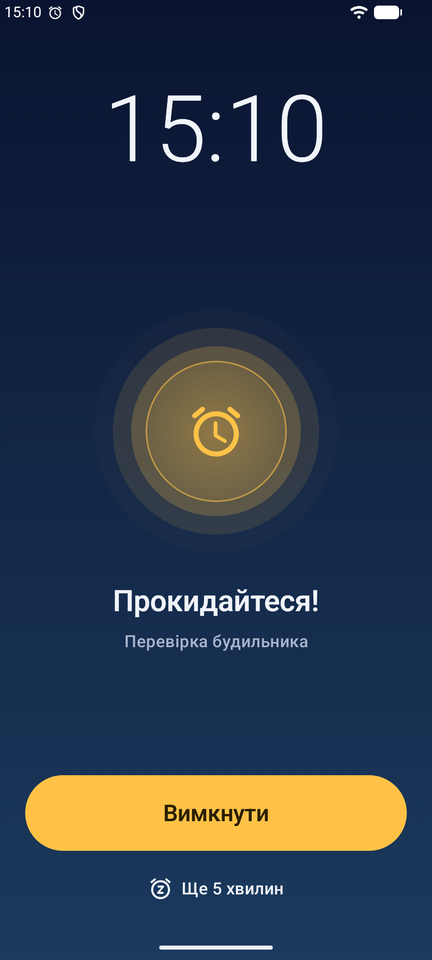
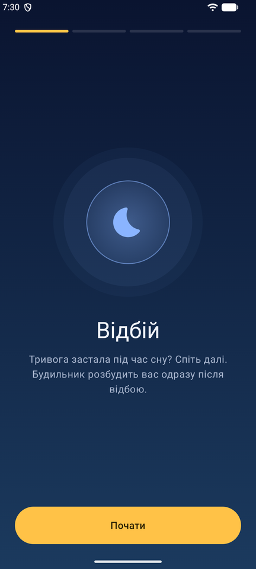
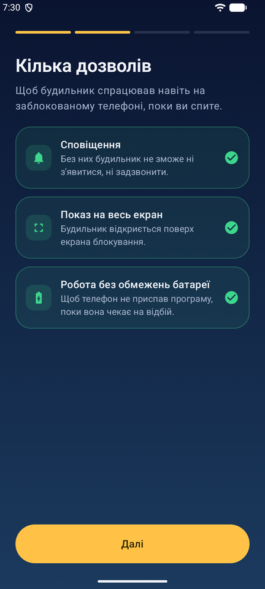
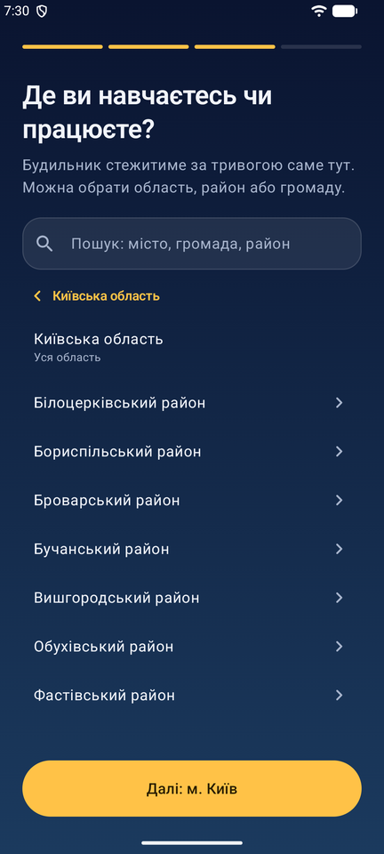
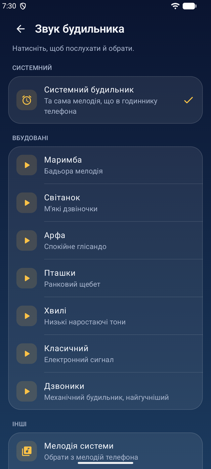
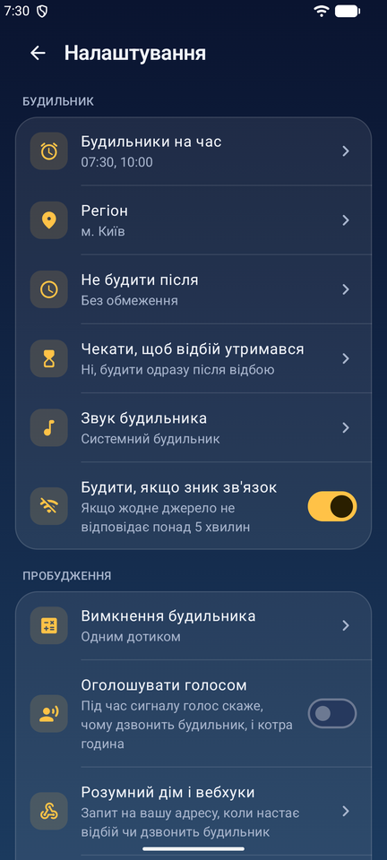
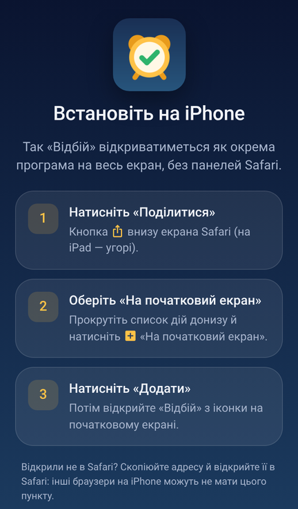
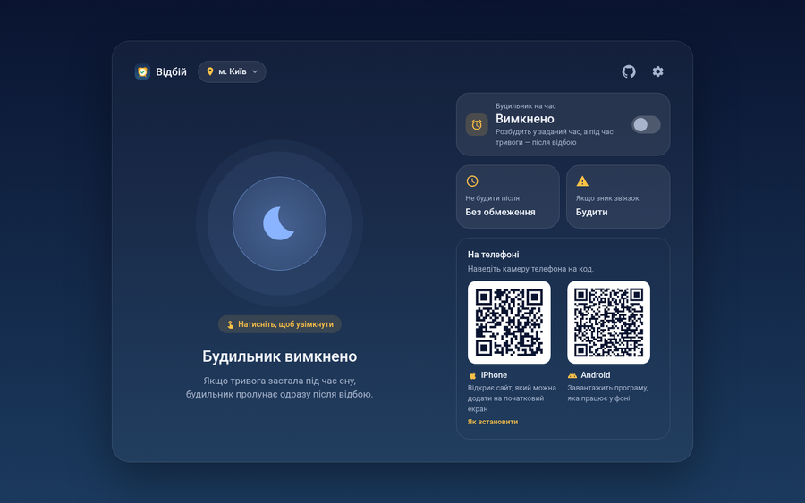

# Відбій

Будильник, що спрацьовує після відбою повітряної тривоги. Тривога застала під час сну? Торкніться місяця й спіть далі: щойно у вашій області, районі чи громаді настане відбій, пролунає гучний будильник. Зручно, наприклад, щоб не проспати онлайн-пару після тривоги.

<p align="center">
  
  
  
</p>

<p align="center">
  <b><a href="https://github.com/OlexiyOdarchuk/vidbiy/releases/latest/download/Vidbiy.apk">⬇ Android: завантажити APK</a></b>
  &nbsp;·&nbsp;
  <b><a href="https://vidbiy.ishawyha.dev/">🌙 Web (PWA): vidbiy.ishawyha.dev</a></b>
</p>

## Яку версію обрати

| Версія | Для кого | Як працює |
|---|---|---|
| **[Android](https://github.com/OlexiyOdarchuk/vidbiy/releases/latest/download/Vidbiy.apk)** | телефони на Android | Програма (APK). Працює у фоні, навіть коли телефон заблоковано. Найнадійніший варіант. |
| **[Web (PWA)](https://vidbiy.ishawyha.dev/)** | iPhone, комп'ютер, будь-який браузер | Сайт, який можна встановити як програму. Працює, поки сторінка відкрита. |

Сайт сам підказує, що робити: на Android пропонує завантажити APK, на iPhone показує, як встановити PWA на початковий екран, а на комп'ютері показує QR-коди для телефонів.

## Як це працює

1. **Оберіть місце**: область, район або громаду, де ви навчаєтесь чи працюєте.
2. **Торкніться місяця**, коли тривога застала під час сну. Програма перевіряє стан тривоги кожні 20 секунд.
3. **Прокиньтеся після відбою.** На весь екран увімкнеться будильник, навіть у беззвучному режимі.
4. Після **«Вимкнути»** програма зупиняється й до наступного разу у фоні не працює.

Якщо ввімкнути будильник, коли тривоги немає, він дочекається наступної тривоги й спрацює після її відбою.

## Можливості

- **Область, район або громада.** Пошук за назвою або перехід «область → район → громада». Тривогою вважається тривога в самому місці, у тому, що його охоплює (район, область), або в будь-якій його частині.
- **Звук на вибір.** На Android за замовчуванням грає системна мелодія будильника (та сама, що в «Годиннику»). Є сім вбудованих мелодій (маримба, світанок, арфа, пташки, хвилі, класичний, дзвоники) з прослуховуванням. Можна поставити свій аудіофайл, а на Android ще й будь-яку мелодію телефона. Якщо обраний звук не відкривається, грає запасний, тож будильник не промовчить.
- **Будильники на час, що враховують тривогу.** Ставите час (наприклад, 07:30) і дні — будні, щодня, вихідні чи один раз; будильників може бути кілька, і кожен може перевіряти тривогу в іншому місці. У цей час програма перевіряє тривогу: немає — дзвонить одразу, як звичайний будильник; триває — чекає й будить після відбою. Без інтернету дзвонить за розкладом, щоб ви не проспали. На Android це системний будильник: спрацює на заблокованому телефоні й після перезавантаження; на сайті — поки сторінка відкрита.
- **Правила нічної тривоги** (за бажанням). Якщо вночі була тривога, будильник на час спрацює пізніше або не дзвонитиме: наприклад, «якщо тривога була з 00:00 до 06:00 — будити о 09:00» чи «якщо тривога тривала понад 3 години — не будити». Налаштовуються проміжок ночі, мінімальна тривалість тривоги й дія; вмикаються окремо для кожного будильника. Історія тривог — із siren.pp.ua; якщо її не вдалося отримати, будильник спрацює у звичайний час.
- **«Чекати, щоб відбій утримався»** (за бажанням). Тривога часто повторюється за кілька хвилин, тож можна будити лише тоді, коли відбій протримався 5–30 хвилин. За замовчуванням будить одразу.
- **«Не будити після».** Якщо відбій настане пізніше заданого часу, наприклад коли пари вже закінчились, будильник вимкнеться без сигналу.
- **«Будити, якщо зник зв'язок».** Сигнал, якщо жодне джерело даних не відповідає понад 5 хвилин, щоб не проспати через збій мережі. Якщо до будильника на час лишилося менше доби, через зв'язок він не будить уночі — спрацює в заданий час.
- **Автооновлення.** Android-програма сама знаходить нові версії на GitHub і встановлює їх, коли будильник вимкнено (один раз треба дозволити встановлення з програми). Сайт перезавантажується на нову версію, коли будильник вимкнено й відкрито головний екран.
- **Вимкнення із завданням** (за бажанням): щоб не вимкнути будильник крізь сон, треба розв'язати приклад (три рівні, 1–5 прикладів) або струснути телефон 10–50 разів. «Ще 5 хвилин» — без завдання.
- **Голосове оголошення** (за бажанням): під час сигналу голос каже, чому дзвонить будильник і котра година (потрібен український голос у телефоні чи браузері).
- **Розумний дім і вебхуки** (за бажанням): запит на вашу адресу, коли вмикається очікування, починається тривога, настає відбій, дзвонить чи вимикається будильник. Метод, заголовки й тіло налаштовуються, з підстановками `{event}`, `{place}`, `{time}`, `{timestamp}`, `{reason}` — наприклад, щоб увімкнути світло через Home Assistant. Android надсилає й на локальні http-адреси, сайт — лише на https.
- **Статистика:** ваші ночі за 30 днів і тривоги у вашому місці — середня й найдовша тривалість, частка нічних, стовпчики по днях.
- **Перевірка перед сном.** Попередить про низький заряд, відсутність інтернету, а на Android — і про повну тишу «Не турбувати».
- **Світанок перед будильником на час** (за бажанням): за 5–20 хвилин екран поволі світлішає.
- **Повідомлення про початок тривоги** (за бажанням): тихо, лише вібрацією.
- **Історія ночей:** коли вмикалося очікування, були тривога й відбій і чому дзвонив будильник.
- **На Android:** плитка «Відбій» у швидких налаштуваннях, віджет на головний екран, за бажанням — вібрація на годиннику.
- **На сайті:** за бажанням — сповіщення, коли сторінка закрита чи призупинена (Web Push; на iPhone — для програми з початкового екрана, iOS 16.4+).
- **«Ще 5 хвилин»**, вібрація, на Android — поступове наростання гучності.
- **Знайомство з програмою** під час першого запуску: дозволи, вибір місця, звук і короткий тур.

<p align="center">
  
  
  
  
  
</p>

## Android

1. Завантажте [`Vidbiy.apk`](https://github.com/OlexiyOdarchuk/vidbiy/releases/latest/download/Vidbiy.apk) і відкрийте його на телефоні. Android попросить дозволити встановлення з невідомих джерел.
2. Під час першого запуску дайте дозволи: сповіщення, показ на весь екран, робота без обмежень батареї. На Samsung і Xiaomi останній особливо важливий, інакше система може приспати програму.

Нові версії встановлюються поверх старих, налаштування зберігаються. Потрібен Android 8.0 або новіший.

## Web (PWA)

<p align="center">
  
  
</p>

Браузери, а особливо iPhone, не дають сайтам працювати у фоні, тому Web-версія працює в «режимі тумбочки».

**На iPhone:**

1. Відкрийте **vidbiy.ishawyha.dev** у Safari → «Поділитися» → «На початковий екран». Сайт відкриватиметься як окрема програма.
2. Коли почалась тривога, торкніться місяця, поставте телефон на зарядку й залиште програму відкритою.
3. Екран не гасне, а через 30 секунд сторінка затемнюється майже до чорного. Після відбою грає гучний сигнал. Він звучить навіть у беззвучному режимі, але гучність береться з кнопок гучності.

Якщо згорнути програму чи заблокувати телефон, iOS зупинить сторінку й будильник не спрацює. Після повернення програма попередить, скільки часу вона не стежила за тривогою.

**На комп'ютері** вкладку можна не тримати на виду: у фоні браузер перевіряє тривогу рідше, приблизно раз на хвилину. Головне — не закривати вкладку й не присипляти комп'ютер.

## Джерела даних

| Джерело | Ключ | Рівень | Примітка |
|---|---|---|---|
| [siren.pp.ua](https://siren.pp.ua/) | не потрібен | область, район, громада | обгортка над api.ukrainealarm.com, основне джерело |
| [ubilling.net.ua](https://wiki.ubilling.net.ua/doku.php?id=aerialalertsapi) | не потрібен | область | запасне джерело |
| [alerts.in.ua](https://devs.alerts.in.ua/) | власний | область | лише в Android, необов'язкове, ключ вводиться в налаштуваннях |

Якщо основне джерело недоступне, програма по черзі звертається до інших. Для району чи громади працює лише siren.pp.ua, бо інші джерела знають тільки області.

> Жодне з цих API не гарантує 100% надійності. Для важливих подій варто мати запасний звичайний будильник.

## Структура репозиторію

| Шлях | Що там |
|---|---|
| [`app/`](app/) | Android-програма: Kotlin, Jetpack Compose, Material 3. Мережа — HttpURLConnection і org.json, без сторонніх бібліотек. |
| [`web/`](web/) | Сайт (PWA): HTML, CSS і JavaScript без збирання. Публікується на GitHub Pages. |
| [`worker/`](worker/) | Проксі на Cloudflare Worker. siren.pp.ua та ubilling не дозволяють браузерам читати свої дані з інших сайтів (немає CORS), тому сайт ходить через нього. Відповіді кешуються на 15 секунд. |
| [`scripts/`](scripts/) | Збирання APK і сайту для Windows, Linux і macOS. |
| [`tools/`](tools/) | Генератори: звуки (`make_sounds.py`), QR-коди (`make_qr.py`), прев'ю для соцмереж (`make_og.py`). |
| [`docs/screenshots/`](docs/screenshots/) | Скріншоти для цього README. |

## Збирання й публікація

Готові скрипти лежать у [`scripts/`](scripts/). Результат потрапляє в `dist/`.

| Що | Windows | Linux і macOS |
|---|---|---|
| Android APK | `scripts\build-android.bat` (можна подвійним кліком) | `./scripts/build-android.sh` |
| Сайт (Web/PWA) | `scripts\build-web.bat` | `./scripts/build-web.sh` |

**Android.** Потрібні JDK 17–24 і Android SDK (найпростіше поставити Android Studio). Скрипт сам знаходить їх: у `JAVA_HOME` і `ANDROID_HOME`, у `PATH`, у `local.properties` і в стандартних місцях, зокрема JDK з Android Studio. Якщо чогось бракує, пояснить, що встановити. Результат: `dist/Vidbiy.apk` і `dist/Vidbiy-<версія>.apk`, обидва варто додавати до релізу. На другий веде постійне посилання `…/releases/latest/download/Vidbiy.apk` і QR-код на сайті.

Кожен пуш у `main` також збирає APK у GitHub Actions ([`build.yml`](.github/workflows/build.yml)).

**Сайт.** Потрібен лише Python 3.9+. Скрипт копіює `web/` у `dist/web` і додає до адрес файлів версію коміту, щоб кеш Cloudflare не віддав новий `index.html` зі старим `app.js`. З параметром `--serve` одразу запускає сайт на http://localhost:8000 (проксі дозволяє саме цей порт):

```sh
./scripts/build-web.sh --serve
```

Зміни в `web/` публікуються автоматично ([`pages.yml`](.github/workflows/pages.yml)) тим самим скриптом.

**Проксі й сповіщення (Worker).** Окрім проксі, Worker щохвилини (cron) стежить за тривогою для тих, хто ввімкнув сповіщення на сайті, і надсилає Web Push. Стан зберігається в базі D1. Перше налаштування:

```sh
cd worker
wrangler d1 create vidbiy                          # id бази вписати в wrangler.toml (database_id)
wrangler d1 execute vidbiy --remote --file schema.sql
wrangler secret put VAPID_PRIVATE_KEY              # закритий ключ VAPID (JWK у JSON)
wrangler deploy
```

Відкритий ключ VAPID лежить у `wrangler.toml`; нова пара ключів робить наявні підписки недійсними. Далі — просто `wrangler deploy`.

Дозволені адреси сайту задані в `ALLOWED_ORIGINS` у [`worker/src/index.js`](worker/src/index.js).

**Звуки, QR-коди й прев'ю.**

```sh
python3 tools/make_sounds.py   # web/sounds/ та app/src/main/res/raw/ (потрібні numpy і ffmpeg)
uv run tools/make_qr.py        # web/qr/
python3 tools/make_og.py       # web/og.png (потрібен Playwright)
```
